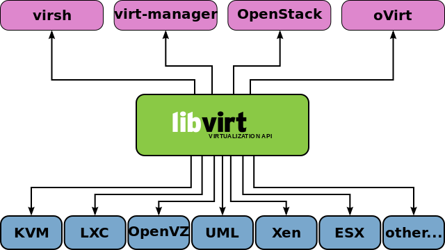

# Cloud

    This repository is intended to explore some cloud related technologies and terms like

    1. KVM
    2. QEMU
    3. Libvirt
    4. QCOW2
    5. Vagrant
    6. Cloud-Init
    7. Ansible
    8. Docker

# Raw Section

## 1. KVM

Kernel-based virtual machine is a virtualization infrastructure for the Linux Kernel that turns it into a hypervisor:

A hypervisor or virtual machine monitor is a computer software, firmware or hardware that creates and runs virtual machines. The hypervisor presents the guest operating system with a virtual operating platform and manages the execution of host operating systems.

There aret two types of hypervisors. 

* Native or Bare Metal Hypervisors

These hypervisors run directly on the hosts hardware to control the hardware and to manage guest operating systems. For this reason they are sometimes called bare metal hypervisors

eg. Xen , Oracle VM Server for Sparc, Oracle VM Server for x86, Microsoft Hyper-V

* Hosted Hypervisors

These hypervisors run on a conventional operating system just as other computer programs do. A guest operating system runs as a process on the host. Type-2 hypervisors abstract guest operating systems from the host operating systems.

eg. VMware, Workstation, VirtualBox, QEMU 

The distinction between these two types is not necessarily clear. Linux KVM and FreeBSD bhyve are kernel modules that effectively convert the host operating system to type-1 hypervisor.

At the sametime, Linux distributions and freebsd are still general purpose operating systems, with other applications competing for VM resources, KVM and bhyve can also be categorized as type-2 hypervisors.

You can run instances of variety of operating systems that will share the virtualized hardware resources. This is in contrast with the operating system-level virtualization ( like containers ) where all instances share same kernel

## 2. QEMU

QEMU ( short for Quick Emulator ) is a free and opensource hosted  hypervisor  that performs hardware virtualization. QEMU is a hosted hypervisor. It emulates cpu through dynamic binary translation and provides a set of device models enabling it to run a variety of unmodified guest operating systems.

It also can be used with kvm to run virtual machines at near-native speed ( requiring hardware virtualization extension on x86 machines) . 

QEMU is little slower when it comes to system which dont have hardware virtualization. KVM helps QEMU to acess hardware acceleration features on different architectures.

It also adds the acceleration feature to the QEMU process. So in short when they are used together, QEMU is the hypervisor / emulator and KVM is the accelerating agent.

QEMU can also do CPU emulation for user level process, allowing applications compiled for one architecture to run on another.

    we will use kvm + QEMU combination in this tutorial

## 3. Libvirt

Libvirt is simply a virtualization management library. It manages both KVM and QEMU . It consist of three utilities namely - an API library, a daemon ( libvirtd ) and a command line tool ( virsh ) . Libvirt is quite effective and it can manage a lot of hypervisors altogether.

libvirt is a C library with bindings in other languages. ( python, perl, ruby,java , javascript via nodejs and php )

## 4. VM creation

There are three tools that are used for same purpose. We need to make sure how they are different

`virsh`  is a command line interface that can be used to create , destroy  , stop , start and edit vm's and configure virtual environments like virtual networks 

`virt-install`  is a command line tool that simplifies the process of creating a vm

`virt-manager`  is a gui that can be used for the same purpose as `virsh`

kvm is a full virtualization solution for linux hardware containing virtualization extensions ( intel VT or amd-v) . It consist of a loadable kernel module kvm.ko that provides the core virtualization infrastructure and a processor specific module kvm-intel.ko or kvm-amd.ko

    apt install qemu-kvm libvirt-clients libvirt-daemon-system

    adduser jithin libvirt
    adduser jithin libvirt-qemu

    reboot

    virsh list --all

since libvirt defaults to qemu:///session for non-root . so from your user you will need to 

virsh --connect qemu:///system list --all

install a vm ( it requires the virt-viewer for graphical display.)

virt-install --virt-type kvm --memory 1024 --disk size=10 --cdrom ~/Downloads/debian9.iso --name debianstretch

it will let us into installing debian ... Once installed we have an image file in Virtual Machines folder with qcow2 format.

# 3. QCOW2

Qcow2 is a file format for disk image files used by QEMU. It stands for QEMU copy on write and
it uses a disk storage optimization strategy that delays allocation of storage unit until it is acutally needed. 

one of the main characteristics of qcow disk images is that files with this format can grow as data is added.  This is contrast with raw disk images , which allocate the whole image space to a file, even it parts of it are empty.

qcow format also allows storing changes made to a read only base image on a separate qcow file by using copy on write. This new file contains the path to the base image to be able to refer back to it when required. When a particular piece of data has to be read from this new image, the content is retrieved from it,if it is new and was stored there.if it is not , the data is fetched from the base image.

raw image..when dd an iso

dd if=debian9.iso of=debian.raw

qemu-img convert -f raw -O qcow2 debian.raw debian.qcow2.

 

